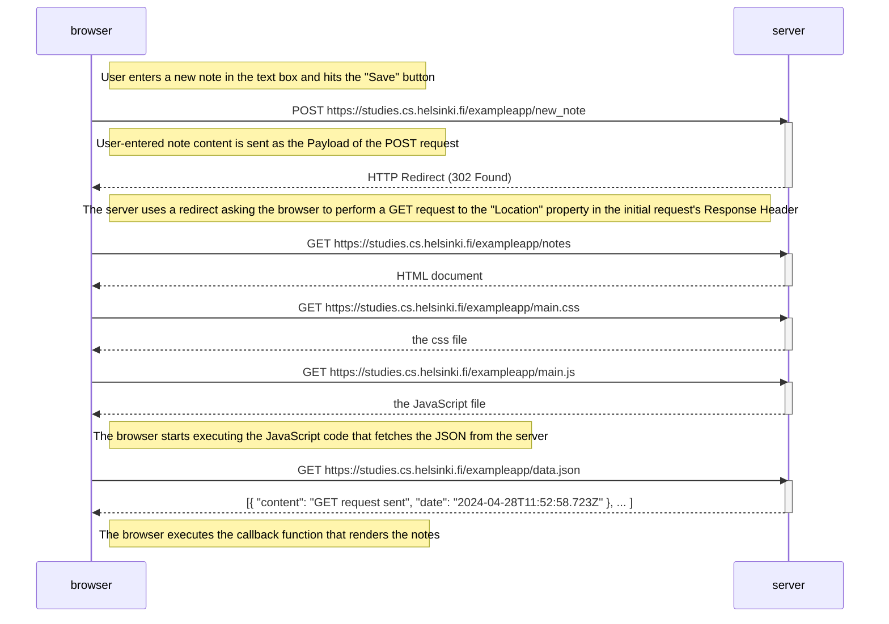

```mermaid
sequenceDiagram
    participant browser
    participant server
    
    Note right of browser: User enters a new note in the text box and hits the "Save" button

    browser->>server: POST https://studies.cs.helsinki.fi/exampleapp/new_note
    activate server
    
    Note right of browser: User-entered note content is sent as the Payload of the POST request

    server-->>browser: HTTP Redirect (302 Found)
    deactivate server
    
    Note right of browser: The server uses a redirect asking the browser to perform a GET request to the "Location" property in the initial request's Response Header

    browser->>server: GET https://studies.cs.helsinki.fi/exampleapp/notes
    activate server
    server-->>browser: HTML document
    deactivate server

    browser->>server: GET https://studies.cs.helsinki.fi/exampleapp/main.css
    activate server
    server-->>browser: the css file
    deactivate server

    browser->>server: GET https://studies.cs.helsinki.fi/exampleapp/main.js
    activate server
    server-->>browser: the JavaScript file
    deactivate server

    Note right of browser: The browser starts executing the JavaScript code that fetches the JSON from the server

    browser->>server: GET https://studies.cs.helsinki.fi/exampleapp/data.json
    activate server
    server-->>browser: [{ "content": "GET request sent", "date": "2024-04-28T11:52:58.723Z" }, ... ]
    deactivate server

    Note right of browser: The browser executes the callback function that renders the notes
```