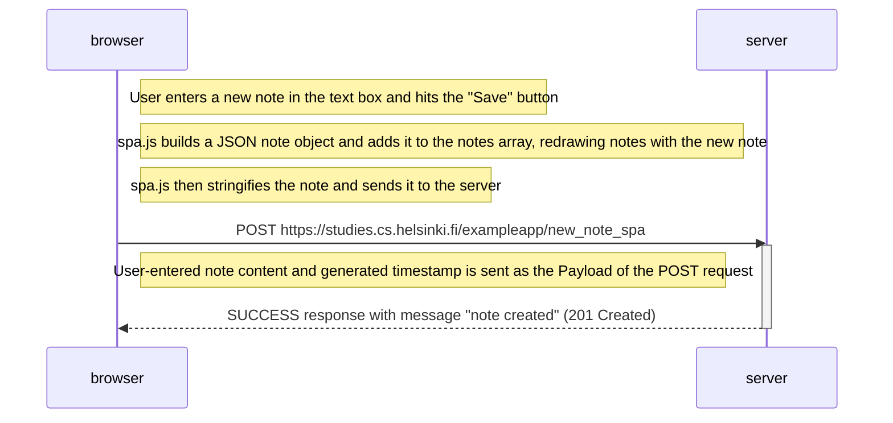

```mermaid
sequenceDiagram
    participant browser
    participant server

    Note right of browser: User enters a new note in the text box and hits the "Save" button

    Note right of browser: spa.js builds a JSON note object and adds it to the notes array, redrawing notes with the new note

    Note right of browser: spa.js then stringifies the note and sends it to the server

    browser->>server: POST https://studies.cs.helsinki.fi/exampleapp/new_note_spa
    activate server
    
    Note right of browser: User-entered note content and generated timestamp is sent as the Payload of the POST request
    
    server-->>browser: SUCCESS response with message "note created" (201 Created)
    deactivate server
```